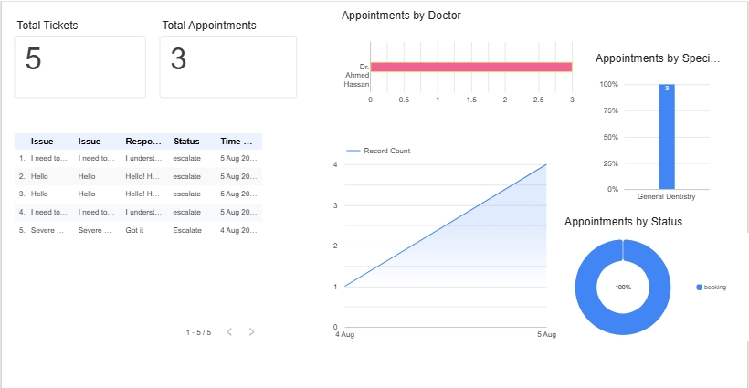
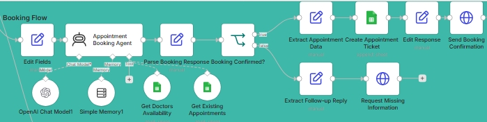
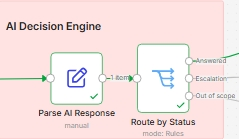
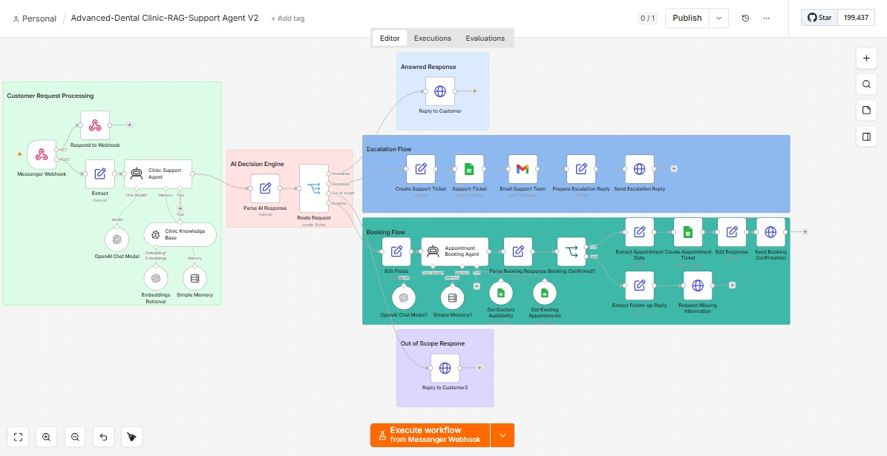

# 🦷 AI Dental Clinic Customer Support & Appointment Booking System

An advanced AI-powered customer support and appointment booking system built using **n8n**, **OpenAI**, **Pinecone Vector Store**, and **Retrieval-Augmented Generation (RAG)**.

The workflow combines AI-powered knowledge retrieval, automated appointment scheduling, intelligent routing, human escalation, and real-time analytics into one complete solution for modern dental clinics.

---

# ✨ Key Features

### 🤖 AI-Powered Customer Support (RAG)
Uses OpenAI with Pinecone Vector Store to provide accurate, context-aware answers based on the clinic's knowledge base.

### 📅 AI Appointment Booking
Patients can book appointments directly through the AI assistant. The workflow checks doctor availability, schedules appointments, and stores booking information automatically.

### 📊 Dashboard & Analytics
Provides a centralized dashboard for monitoring appointments, support tickets, workflow performance, and customer interactions.

### 🔄 Automated Knowledge Synchronization
Keeps the clinic knowledge base up to date using:

- Automatic Google Drive Trigger
- Manual Ingestion Pipeline

Documents are automatically processed, chunked, embedded, and stored in Pinecone.

### ⚡ Intelligent AI Routing
Every customer request is evaluated based on confidence and intent before being routed automatically.

### 🚨 Human Escalation
When AI cannot confidently answer:

- Generates a unique Ticket ID
- Logs customer information into Google Sheets
- Sends an email notification to the support team
- Notifies the customer that a human agent will follow up

### ⚪ Out-of-Scope Detection
Politely handles unsupported or unrelated questions while keeping the conversation professional.

### ⚡ Real-Time Messenger Integration
Processes incoming Meta Messenger Webhooks instantly for seamless communication.

# 📸 Project Preview

## 🖥️ Dashboard



---

## 📅 Appointment Booking Flow



---

## 🤖 AI Decision Engine



---

## 🔄 Agent Overview


---

# 🆕 Version 2 Improvements

✅ AI Appointment Booking Flow

✅ Interactive Dashboard

✅ Improved Workflow Logic

✅ Better Ticket Management

✅ Enhanced AI Routing

✅ Performance Optimizations

---

# 🏗️ System Architecture

```
             Google Drive
                   │
           Automatic / Manual
             Knowledge Sync
                   │
         Recursive Text Splitter
                   │
        OpenAI Embeddings
                   │
          Pinecone Vector Store
                   │
────────────────────────────────────────────

        Customer (Messenger)

                │

      Messenger Webhook

                │

   Customer Request Processing

                │

       AI Decision Engine

      ┌─────────┼─────────┐
      │         │         │
 Answered   Booking   Escalation
      │         │         │
Messenger  Google Sheets Ticket System
      │         │         │
 Dashboard  Booking DB  Email Alerts
```

---

# 🛠️ Workflow Modules

## 1️⃣ Knowledge Base Management

The workflow automatically synchronizes clinic documents into Pinecone.

### Automatic Pipeline

- Google Drive Trigger
- Document Processing
- Recursive Character Text Splitter
- OpenAI Embeddings
- Pinecone Vector Store

### Manual Pipeline

Allows administrators to manually refresh the knowledge base whenever needed.

---

## 2️⃣ Customer Request Processing

Handles incoming patient messages through Messenger.

Responsibilities include:

- Receiving Webhook events
- Extracting customer information
- Processing messages
- Retrieving relevant knowledge using Pinecone
- Passing context to the AI Agent

---

## 3️⃣ AI Decision Engine

The AI evaluates every request and determines the most appropriate action based on:

- Intent
- Confidence
- Retrieved Context
- Business Rules

---

## 4️⃣ Workflow Execution Paths

### 🟢 Answered Response

The AI confidently answers the customer's question immediately.

---

### 📅 Appointment Booking

If the customer wants to schedule a visit:

- Collects booking information
- Validates availability
- Stores appointment data
- Sends confirmation to the patient

---

### 🔵 Human Escalation

If human assistance is required:

- Generates Ticket ID
- Saves ticket into Google Sheets
- Emails the support team
- Notifies the customer

---

### ⚪ Out-of-Scope

Handles unsupported questions with predefined professional responses.

---

# 📸 Screenshots

Screenshots of the workflow, dashboard, and booking flow are available in the **/screenshots** folder.

Included images:

- Workflow Overview
- AI Decision Flow
- Appointment Booking Flow
- Dashboard
- Ticket Management
- Knowledge Base Pipeline

---

# ⚡ Technology Stack

- **Workflow Automation:** n8n
- **AI Model:** OpenAI GPT
- **Vector Database:** Pinecone
- **RAG Architecture**
- **Embeddings:** OpenAI Embeddings
- **Text Chunking:** Recursive Character Text Splitter
- **Database:** Google Sheets
- **Knowledge Storage:** Google Drive
- **Email:** Gmail API
- **Messaging:** Meta Messenger Webhooks
- **Dashboard:** Looker Studio

---

# 🚀 Getting Started

Clone the repository:

```bash
git clone https://github.com/omar-n8n/Advanced-Dental-RAG-Agent.git
```

Import the workflow JSON into your n8n instance.

Configure the following credentials:

- OpenAI API
- Pinecone
- Google Drive
- Google Sheets
- Gmail API
- Meta Messenger
- Looker Studio (Optional)

Activate the workflow and start automating your dental clinic.

---

# 💡 Use Cases

- Dental Clinics
- Medical Centers
- Healthcare Customer Support
- Appointment Scheduling
- AI Receptionist
- AI Customer Service

---

# 👨‍💻 Author

**Omar Ali Osman**

AI Automation Developer

Specialized in building AI-powered workflows using n8n, OpenAI, APIs, and RAG systems.