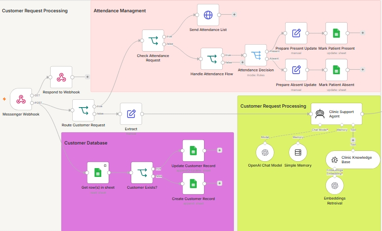
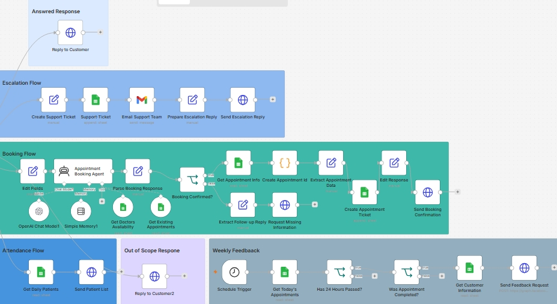
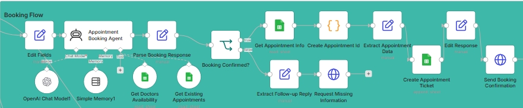
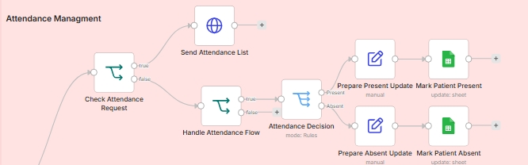
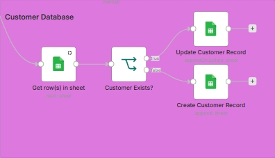
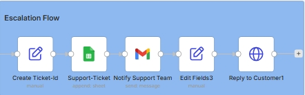
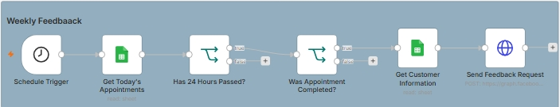

<div align="center">

# 🦷 AI Dental Clinic Automation System

### Enterprise-Grade AI Automation Platform

An intelligent automation platform for modern dental clinics built using **n8n**, **OpenAI**, **Pinecone**, **RAG**, and multiple API integrations.

Designed to automate the entire patient journey—from answering inquiries to booking appointments, managing attendance, maintaining customer records, escalating complex requests, and collecting post-visit feedback.

<br>


<br>


</div>

---

# 📖 Table of Contents

- Project Overview
- Why This Project?
- Business Value
- Core Features
- System Architecture
- Workflow Modules
- Workflow Screenshots
- Technology Stack
- Installation
- Required Credentials
- Future Improvements
- Author

---

# 🦷 Project Overview

This project is a complete AI-powered automation platform for dental clinics.

Unlike a traditional chatbot, this system combines multiple intelligent workflows into a single scalable architecture capable of handling customer communication automatically.

The platform receives customer requests through **Meta Messenger**, analyzes user intent using AI, retrieves clinic knowledge through **Retrieval-Augmented Generation (RAG)**, routes conversations intelligently, books appointments, manages attendance, maintains a customer database, escalates complex cases, and automatically requests patient feedback after appointments.

The entire workflow is fully automated using **n8n** with modular architecture for easy maintenance and scalability.

---

# ⭐ Why This Project?

Most clinics still rely heavily on receptionists to manually:

- Answer repetitive questions
- Schedule appointments
- Track attendance
- Update customer records
- Follow up with patients
- Escalate support cases

This project replaces repetitive manual work with AI-powered workflows while still allowing human intervention whenever necessary.

The result is:

- Faster response times
- Better customer experience
- Reduced administrative workload
- Organized customer database
- Fully automated workflows

---

# 💼 Business Value

This automation platform helps clinics:

✅ Reduce receptionist workload

✅ Answer patients instantly 24/7

✅ Automate appointment booking

✅ Automatically track attendance

✅ Maintain an organized customer database

✅ Reduce missed appointments

✅ Collect patient feedback automatically

✅ Escalate only difficult conversations to staff

✅ Improve operational efficiency

✅ Scale customer support without increasing staff

---

# 🚀 Core Features

## 🤖 AI Customer Support

Provides accurate, context-aware answers using Retrieval-Augmented Generation (RAG).

### Capabilities

- OpenAI GPT
- Pinecone Vector Database
- Conversation Memory
- AI Knowledge Retrieval
- Clinic Knowledge Base
- Natural Language Responses

---

## 📅 AI Appointment Booking

Patients can schedule appointments directly through Messenger.

### Workflow

- Collect patient information
- Validate doctor or specialty
- Check appointment availability
- Create appointment automatically
- Send booking confirmation

---

## ✅ Attendance Management

Reception staff can update attendance directly from Messenger using interactive buttons.

### Workflow

- Patient selection
- Present / Absent confirmation
- Attendance update
- Google Sheets synchronization

---

## 👥 Customer CRM

Automatically manages customer information.

### Includes

- Customer lookup
- Existing customer detection
- New customer creation
- Customer updates
- Messenger ID management
- Customer history

---

## 💬 Weekly Feedback Automation

Automatically follows up with patients after completed appointments.

### Workflow

- Daily schedule trigger
- Appointment validation
- 24-hour waiting period
- Messenger feedback request

---

## 🚨 Human Escalation

When AI confidence is insufficient:

- Generate ticket
- Save ticket information
- Notify support team
- Notify customer

---

## 🧠 AI Decision Engine

Every incoming message is analyzed before selecting the appropriate workflow.

Possible routes include:

- Customer Support
- Appointment Booking
- Attendance Management
- Customer Database
- Human Escalation
- Out-of-Scope Requests

---

# 🏗️ System Architecture

```text
                          Google Drive
                               │
               Knowledge Synchronization Pipeline
                               │
                 Recursive Character Splitter
                               │
                     OpenAI Embeddings
                               │
                  Pinecone Vector Database
                               │
────────────────────────────────────────────────────────────

                     Meta Messenger

                            │

                   Messenger Webhook

                            │

                  Customer Request Router

        ┌─────────────┬─────────────┬─────────────┐
        │             │             │
        ▼             ▼             ▼

   Customer CRM   Attendance    AI Customer Support
                    Workflow            (RAG)

        │             │             │

        └─────────────┴──────┐      │

                              ▼

                     AI Decision Engine

      ┌──────────────┬──────────────┬──────────────┐
      │              │              │
      ▼              ▼              ▼

 Appointment     Escalation      AI Response

      │

      ▼

 Google Sheets Database

      │

      ▼

 Weekly Feedback Workflow

      │

      ▼

 Looker Studio Dashboard
```

---

# 🔄 Workflow Modules

The system is divided into multiple independent automation modules, making it scalable, maintainable, and easy to expand.

---

## 🟨 Knowledge Base Management

Responsible for building and maintaining the clinic's AI knowledge base.

### Responsibilities

- Google Drive Synchronization
- Manual Knowledge Refresh
- Document Processing
- Text Chunking
- OpenAI Embeddings
- Pinecone Storage

---

## ⚪ Customer Request Processing

Handles every incoming Messenger request.

### Responsibilities

- Receive Messenger Webhook
- Identify Customer
- Extract Request
- Route Conversation

---

## 🟢 AI Customer Support

Handles general clinic inquiries using Retrieval-Augmented Generation.

### Features

- Context Retrieval
- AI Conversation
- Conversation Memory
- Knowledge Search
- Intelligent Responses

---

## 🟦 AI Appointment Booking

Responsible for complete appointment scheduling.

### Booking Pipeline

1. Collect Patient Information

2. Validate Doctor / Specialty

3. Check Availability

4. Create Appointment

5. Confirm Booking

---

## 🟥 Attendance Management

Designed for reception staff.

### Attendance Pipeline

1. Detect Attendance Request

2. Display Patient List

3. Select Patient

4. Present / Absent Decision

5. Update Attendance Record

---

## 🟪 Customer CRM

Automatically maintains customer information.

### Features

- Customer Lookup

- Existing Customer Detection

- Create Customer

- Update Customer

- Store Messenger ID

- Customer History

---

## 🔵 Human Escalation

Transfers conversations that AI cannot confidently handle.

### Pipeline

- Generate Ticket

- Save Ticket

- Notify Support Team

- Notify Customer

---

## ⚫ Weekly Feedback Automation

Automatically follows up with patients after appointments.

### Pipeline

- Daily Schedule Trigger

- Validate Appointment

- Retrieve Customer

- Send Messenger Feedback

---

# 📸 Workflow Screenshots

## 🖥️ Complete Workflow




---
## 🖥️ Complete Workflow




---

## 🧠 AI Decision Engine


---

## 📅 Booking-flow



---

## ✅ Attendance



---

## 👥 Customer-Database



---

## 🚨 Human Escalation



---

## 💬 Weekly-Feedback



---

## 📊 Dashboard


---

# 📂 Project Structure

```text
AI Dental Clinic Automation

├── Messenger Webhook

├── Customer Request Processing

├── AI Customer Support

├── AI Decision Engine

├── Appointment Booking

├── Attendance Management

├── Customer CRM

├── Human Escalation

├── Weekly Feedback

├── Knowledge Base

├── Google Sheets

├── Pinecone

└── Dashboard
```

---

# ⚙️ Technology Stack

| Category | Technologies |
|----------|--------------|
| Workflow Automation | n8n |
| Artificial Intelligence | OpenAI GPT |
| AI Architecture | AI Agents |
| Knowledge Retrieval | Retrieval-Augmented Generation (RAG) |
| Vector Database | Pinecone |
| Embeddings | OpenAI Embeddings |
| Database | Google Sheets |
| Knowledge Storage | Google Drive |
| Messaging Platform | Meta Messenger |
| Email Notifications | Gmail API |
| Dashboard | Looker Studio |
| Programming | JavaScript |
| APIs | HTTP Request Nodes |

---

# 🔗 External Integrations

The system integrates with multiple external services:

- ✅ OpenAI API
- ✅ Pinecone
- ✅ Google Drive
- ✅ Google Sheets
- ✅ Gmail API
- ✅ Meta Messenger Webhooks
- ✅ Looker Studio

---

# ⚡ AI Workflow Lifecycle

```text
Customer Message
       │
       ▼
Messenger Webhook
       │
       ▼
Customer Identification
       │
       ▼
Intent Detection
       │
       ▼
AI Decision Engine
       │
 ┌─────┼───────────────┬─────────────┐
 │     │               │             │
 ▼     ▼               ▼             ▼
Support Booking   Attendance   Escalation
 │        │             │            │
 ▼        ▼             ▼            ▼
Reply   Create      Update      Create
        Appointment Attendance  Ticket
```

---

# 🚀 Installation

## 1. Clone Repository

```bash
git clone https://github.com/omar-n8n/AI-Dental-Clinic-Automation-System.git
```

---

## 2. Import Workflow

Open your n8n instance and import the workflow JSON.

---

## 3. Configure Credentials

Create the required credentials:

- OpenAI API
- Pinecone
- Google Sheets
- Google Drive
- Gmail
- Meta Messenger

---

## 4. Activate Workflow

Enable all required workflows.

The system is now ready to receive Messenger messages.

---

# 📋 Required Services

- OpenAI Account
- Pinecone Account
- Google Cloud Project
- Meta Developer Account
- n8n Instance

---

# 🎯 Supported Use Cases

This project can be adapted for:

- 🦷 Dental Clinics
- 🏥 Medical Centers
- 👨‍⚕️ Private Doctors
- 💄 Beauty Clinics
- 🧑‍⚕️ Healthcare Customer Support
- 📅 Appointment Scheduling
- 📞 AI Receptionists
- 🤖 AI Customer Support
- 📊 CRM Automation

---

# 📈 Scalability

The workflow was designed using a modular architecture.

New modules can easily be added, such as:

- WhatsApp Cloud API
- Telegram
- SMS Notifications
- Voice AI Receptionist
- Payment Integration
- Google Calendar
- Multi-Clinic Support
- Patient Reminder System

without modifying the existing architecture.

---

# 🛣️ Future Roadmap

Planned improvements include:

- Voice AI Agent
- WhatsApp Integration
- Google Calendar Synchronization
- Automatic Appointment Reminders
- Online Payments
- Multi-language Support
- Analytics Dashboard Enhancements
- Multi-Clinic Deployment

---

# 📄 License

This project is intended for educational and portfolio purposes.

Feel free to explore the workflow architecture and adapt it for your own automation projects.

---

# 👨‍💻 Author

## Omar Ali Osman

AI Automation Developer

I specialize in building intelligent automation systems using:

- n8n
- OpenAI
- AI Agents
- Pinecone
- RAG
- APIs
- Workflow Automation

### Connect with me

- GitHub: https://github.com/omar-n8n
- LinkedIn: *(Add your LinkedIn profile here)*

---

<div align="center">

## ⭐ If you found this project useful, consider giving it a Star!

It helps others discover the project and supports my work.

---

Made with ❤️ using n8n, OpenAI and AI Automation

</div>